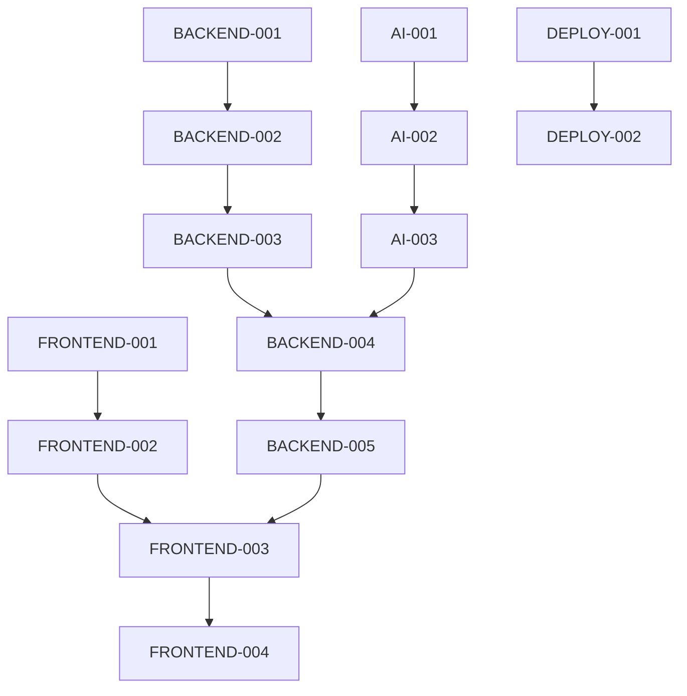

# 开发任务详细分包

## 📦 Package A: 后端开发包

### 🎯 负责AI工具
- **主力**: Claude-3.5-Sonnet (系统架构)
- **辅助**: GPT-4 (数据库设计)
- **专家**: Gemini-Pro (API文档)

### 📋 具体任务列表

#### A1: 项目基础架构 (优先级: 🔥 高)
```yaml
任务ID: BACKEND-001
标题: Go项目基础架构搭建
描述: |
  创建Go项目的基础架构，包括:
  - 项目目录结构
  - Go modules配置
  - Gin框架集成
  - 基础中间件
  - 配置管理
  - 日志系统
估时: 2天
输出文件:
  - backend/main.go
  - backend/go.mod
  - backend/config/
  - backend/middleware/
  - backend/utils/
依赖: 无
```

#### A2: 数据库设计与ORM (优先级: 🔥 高)
```yaml
任务ID: BACKEND-002
标题: PostgreSQL数据库设计
描述: |
  设计完整的数据库架构:
  - 用户管理表
  - 项目和文档表
  - AI对话历史表
  - 规则配置表
  - 性能监控表
  - GORM模型定义
估时: 3天
输出文件:
  - backend/models/
  - backend/database/
  - migrations/
依赖: BACKEND-001
```

#### A3: 三权分立核心架构 (优先级: 🔥 高)
```yaml
任务ID: BACKEND-003
标题: 三权分立系统实现
描述: |
  实现核心的三权分立架构:
  - 立法权: 规则管理器
  - 行政权: Agent执行器
  - 司法权: 质量仲裁器
  - 动态演变机制
  - 智能协调器
估时: 5天
输出文件:
  - backend/core/legislative/
  - backend/core/executive/
  - backend/core/judicial/
  - backend/core/coordinator/
依赖: BACKEND-002
```

#### A4: Agent对抗系统 (优先级: 🟡 中)
```yaml
任务ID: BACKEND-004
标题: 双Agent对抗实现
描述: |
  实现创作Agent和批评Agent的对抗系统:
  - Agent接口定义
  - 创作Agent实现
  - 批评Agent实现
  - 对抗协调机制
  - 结果合成器
估时: 4天
输出文件:
  - backend/agents/
  - backend/agents/creator/
  - backend/agents/critic/
  - backend/agents/coordinator/
依赖: BACKEND-003
```

#### A5: API接口设计 (优先级: 🟡 中)
```yaml
任务ID: BACKEND-005
标题: RESTful API和WebSocket
描述: |
  设计完整的API接口:
  - RESTful API endpoints
  - WebSocket实时通信
  - OpenAPI文档
  - 接口版本管理
  - 错误处理
估时: 3天
输出文件:
  - backend/api/
  - backend/websocket/
  - docs/api/
依赖: BACKEND-004
```

---

## 📦 Package B: 前端开发包

### 🎯 负责AI工具
- **主力**: Claude-3.5-Sonnet (Svelte架构)
- **辅助**: GPT-4 (UI组件)
- **专家**: Gemini-Pro (实时交互)

### 📋 具体任务列表

#### B1: Svelte项目基础 (优先级: 🔥 高)
```yaml
任务ID: FRONTEND-001
标题: SvelteKit项目搭建
描述: |
  创建Svelte前端项目:
  - SvelteKit配置
  - Tailwind CSS集成
  - 项目目录结构
  - 路由配置
  - 状态管理
估时: 2天
输出文件:
  - frontend/package.json
  - frontend/svelte.config.js
  - frontend/src/
  - frontend/static/
依赖: 无
```

#### B2: 核心UI组件库 (优先级: 🔥 高)
```yaml
任务ID: FRONTEND-002
标题: 创作界面组件开发
描述: |
  开发核心UI组件:
  - Monaco编辑器集成
  - 实时预览面板
  - 参数控制面板
  - 进度指示器
  - 通知系统
估时: 4天
输出文件:
  - frontend/src/components/
  - frontend/src/lib/
依赖: FRONTEND-001
```

#### B3: 实时交互系统 (优先级: 🟡 中)
```yaml
任务ID: FRONTEND-003
标题: WebSocket实时通信
描述: |
  实现前端实时交互:
  - WebSocket客户端
  - 实时状态同步
  - 消息队列管理
  - 断线重连
  - 错误处理
估时: 3天
输出文件:
  - frontend/src/websocket/
  - frontend/src/stores/
依赖: FRONTEND-002
```

#### B4: 可视化工作流 (优先级: 🟢 低)
```yaml
任务ID: FRONTEND-004
标题: 节点化编辑界面
描述: |
  实现可视化工作流:
  - 节点编辑器
  - 关系图谱
  - 拖拽操作
  - 缩放和平移
  - 数据可视化
估时: 5天
输出文件:
  - frontend/src/components/workflow/
  - frontend/src/components/visualization/
依赖: FRONTEND-003
```

---

## 📦 Package C: AI算法包

### 🎯 负责AI工具
- **主力**: Claude-3.5-Sonnet (算法架构)
- **辅助**: GPT-4 (NLP实现)
- **专家**: Gemini-Pro (机器学习)

### 📋 具体任务列表

#### C1: 情绪分析引擎 (优先级: 🟡 中)
```yaml
任务ID: AI-001
标题: 文本情绪分析系统
描述: |
  开发情绪分析引擎:
  - 情绪分类模型
  - 强度计算算法
  - 情绪曲线生成
  - 实时分析接口
  - 模型训练脚本
估时: 4天
输出文件:
  - ai-algorithms/emotion/
  - ai-algorithms/models/
  - ai-algorithms/training/
依赖: 无
```

#### C2: 角色一致性检查 (优先级: 🟡 中)
```yaml
任务ID: AI-002
标题: 角色行为一致性验证
描述: |
  实现角色一致性检查:
  - 角色画像构建
  - 行为模式分析
  - 一致性评分
  - 异常检测
  - 建议生成
估时: 4天
输出文件:
  - ai-algorithms/character/
  - ai-algorithms/consistency/
依赖: AI-001
```

#### C3: 智能上下文管理 (优先级: 🔥 高)
```yaml
任务ID: AI-003
标题: Claude Code压缩算法
描述: |
  实现智能上下文管理:
  - 92%阈值压缩算法
  - 重要性评分
  - 分层存储
  - 检索优化
  - 缓存策略
估时: 5天
输出文件:
  - ai-algorithms/context/
  - ai-algorithms/compression/
  - ai-algorithms/retrieval/
依赖: AI-002
```

---

## 📦 Package D: 部署运维包

### 🎯 负责AI工具
- **主力**: Claude-3.5-Sonnet (DevOps架构)
- **辅助**: GPT-4 (Docker配置)
- **专家**: Gemini-Pro (监控系统)

### 📋 具体任务列表

#### D1: 容器化配置 (优先级: 🟡 中)
```yaml
任务ID: DEPLOY-001
标题: Docker和Docker Compose
描述: |
  创建容器化配置:
  - 多阶段Dockerfile
  - docker-compose.yml
  - 环境变量配置
  - 网络配置
  - 数据卷管理
估时: 2天
输出文件:
  - Dockerfile
  - docker-compose.yml
  - deployment/docker/
依赖: 无
```

#### D2: CI/CD流水线 (优先级: 🟢 低)
```yaml
任务ID: DEPLOY-002
标题: GitHub Actions配置
描述: |
  设置自动化流水线:
  - 代码检查
  - 自动测试
  - 构建部署
  - 版本管理
  - 通知机制
估时: 3天
输出文件:
  - .github/workflows/
  - scripts/
依赖: DEPLOY-001
```

## 🔄 任务依赖关系



## 📊 开发时间线

- **第1周**: A1, A2, B1, C1, D1 (并行开发)
- **第2周**: A3, B2, C2 (核心功能)
- **第3周**: A4, B3, C3 (集成开发)
- **第4周**: A5, B4, D2 (完善功能)
- **第5周**: 集成测试和优化